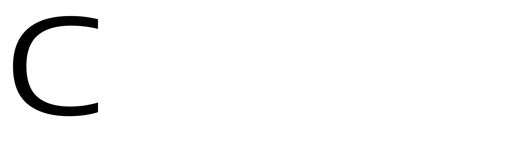
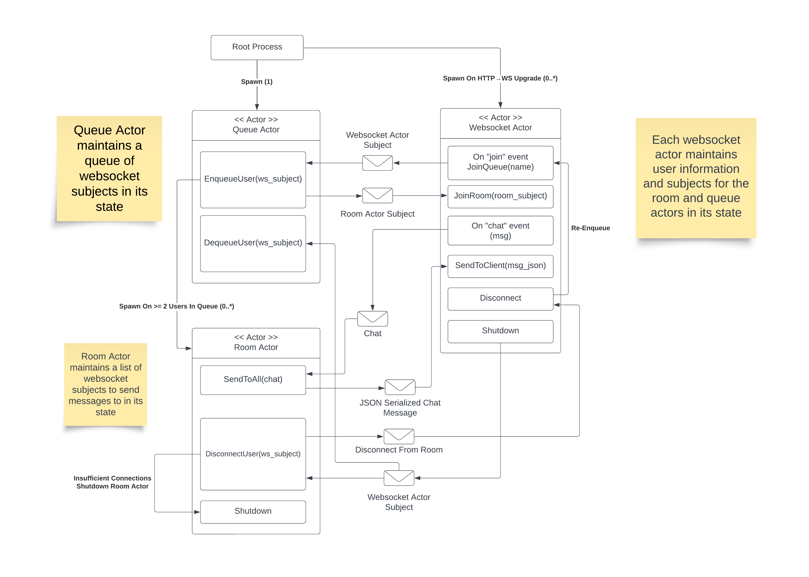

# 

> A massively concurrent chat application designed for real-time, one-on-one conversations.

 

### Overview
This project is a re-implementation (with some differences) using **Gleam** (compiled to **Erlang**) to a version I developed a while ago with **Node.js**. The underlying architecture is entirely different than the old version which will be described below.

 

### Why Re-Implement in Gleam?
I wanted to re-implement this project in **Gleam** because the language is brand new, I wanted to start learning functional programming, and it has a lot of features I like. Personally, type safety is very important to me and I simply cannot stand writing in dynamicly typed languages which is what I did not like about the alternative languages that run on the **BEAM VM**, **Erlang** and **Elixir**. Additionally, as somebody who also enjoys the **Rust** programming language, a lot of the syntax in **Gleam** felt familiar which also helped me ease into the functional programming workflow. Finally, **Gleam** is extremely simple. It did not take long to pick up and its ability to make concurrent applications is unmatched compared to **Node.js** (which is single-threaded anyway) and **Rust** (Rust async programming is another world of difficulty).

 

### Chatter API Actor Model

Concurrent applications developed with **Erlang** based languages typically use the **Actor Model**. Each actor in the system is its own process, and therefore is allocated its own thread and memory resources by the **BEAM VM**. Each actor has a *mailbox* which are addressed via a *subject* in **Gleam** (*PID* in **Erlang** and **Elixir**). Actors receive messages in their mailbox and from there can perform actions at the same time as other actors in the system. Due to the fact that this model does not use shared memory between processes, concurrency primitives such as *Mutexes* are not needed, thus avoiding associated complexity and problems. The Actor Model inherintly provides a seperation of concerns by encapsulating logic within each actor, allowing scalable and reliable systems to be developed easily.

 
 

  Developed and Tested by <b>Connell Reffo</b> in <b>2024</b>

