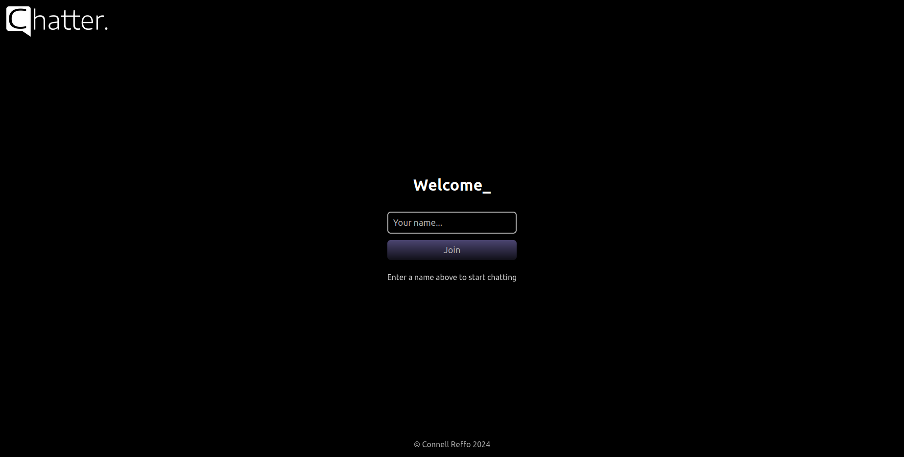
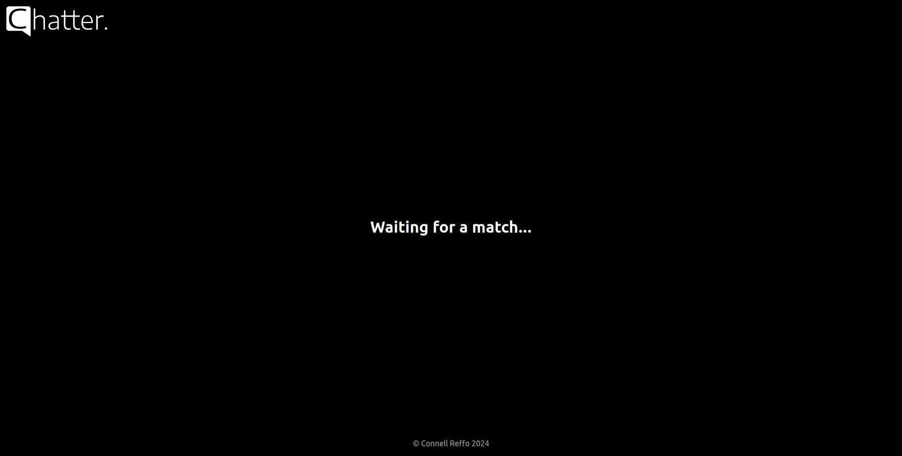

# 

> A massively concurrent chat application designed for real-time, one-on-one conversations.

 

## Deployment

This demonstration project is deployed **On Render** <a href="https://chatter-5dkr.onrender.com/">here</a>

 

## Overview

This project is a variation of a previous project, **Chatter**, re-implemented in **Gleam**. This version is essentially just the text chat aspect of **Omegle** (which no longer exists). It allows users to speed chat with random strangers in real-time.

 

## Why Re-Implement in Gleam?

I chose to re-implement this project in **Gleam** for several reasons:

- **Learning Functional Programming**: I wanted to start learning functional programming, and Gleam provides a great opportunity to do so.
- **Type Safety**: Type safety is crucial for me, and Gleam offers strong type guarantees, unlike the dynamically typed **Erlang** and **Elixir**.
- **Familiar Syntax**: As someone who enjoys the **Rust** programming language, I found Gleam’s syntax familiar, which eased my transition into functional programming.
- **Simplicity and Concurrency**: Gleam is simple to pick up and excels at creating concurrent applications.

 

# Screenshots

 
 

  Developed and Tested by <b>Connell Reffo</b> in <b>2024</b>

